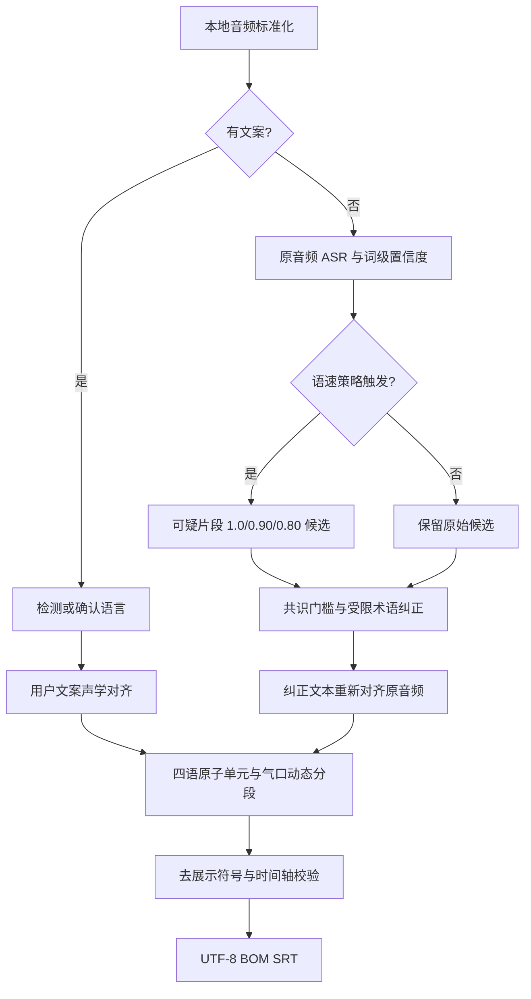

# 精准 SRT 模式 A/B 架构与验收

> 状态：核心实现完成，发布验收未全部完成  
> 日期：2026-08-29  
> 对应任务包：[`20260829-精准SRT模式AB产品化.md`](../AI协作/任务包/20260829-精准SRT模式AB产品化.md)

## 当前差距

产品原有模式 A 的 `alignKnownText()` 只在 ASR chunk 时间上贴回用户文案；当原文句数与 ASR 段数不一致时，还会按字符数比例分配时间。它能保证文字来自用户文案，但不能证明字幕边界与真实发音对齐。

产品原有模式 B 只保留 Faster-Whisper chunk，不保存 word probability，也没有低置信度复识别、内置术语纠正、原音频重新对齐和四语词边界分段。

## 产品化数据流



## stable-ts 来源固定

- 上游版本：2.19.1。
- 本地来源：`D:\Project\srt\stable-ts-main\stable_whisper`。
- 许可证：MIT，复制时保留上游 LICENSE 和版权声明。
- 产品位置：`python/src/stable_whisper/`。
- 约束：业务代码只允许从 `koubox_runtime.precise_srt` 使用该快照。
- 验证：复制完成后生成 `python/src/stable_whisper/SHA256SUMS.txt`，逐文件记录哈希。

## 语速自适应

语速不会通过修改用户源文件来“统一”。原始音频先做一次完整识别，再结合有效发声时长、语言单位速度和词置信度决定是否重试。

阈值已经从 Python 分支逻辑移入随版本发布的 `precise_srt_terms.toml`，便于固定版本与审计。2026-08-31 已完成 FLEURS validation 四语各 30 条的相对峰值 VAD 标定，配置保留 q90 候选值 `zh=5.74 / en=3.26 / ja=6.76 / ko=6.11`（version=2）。FLEURS test/变速真实指标已补入数据清单；快速改善门槛未全通过，因此不宣称性能门槛通过。

| 模式 | 行为 |
|------|------|
| 关闭 | 不生成变速候选，仍执行内置精确术语规则 |
| 自动 | 快速且低置信度时，对可疑片段生成三路候选 |
| 强制 | 不检查快速门槛，但仍只处理可疑片段 |

候选只负责选择文字。最终字幕时间始终通过原始音频重新对齐获得。

## 四语分段

| 语言 | 不可拆单元 | 展示上限 |
|------|------------|----------|
| 中文 | 完整对齐词、审批术语、虚词组合 | 14 个有效字符 |
| 日文 | stable-ts 词与 Janome 短语交集、审批术语 | 14 个有效字符 |
| 英文 | 完整单词、审批术语、功能词组合 | 8 个词且不超过 42 字符 |
| 韩文 | 完整空格词组、审批术语 | 18 个有效字符 |

气口只提供候选边界。软气口必须同时满足语法边界或超长约束，硬气口也不得切开不可拆单元。

## 输出边界

生产任务只增加最终 `.srt`。候选文本、变速临时音频和完整审计数据不进入用户输出目录；候选决策摘要进入任务记录与应用日志。测试运行可以在验证目录保存详细 JSON，用于文档化验收。

实现层已经把“保存 Transcript 到 TaskSnapshot”与“导出 `*_原文案.txt`”拆开：精准 SRT 仅把最终 Transcript 留给页面预览并登记最终 SRT，不额外生成原文案文本；通用语音转文字继续保留原有文本文件行为。

## 改造前基线

| 检查 | 结果 |
|------|------|
| core 测试 | 56/56 通过 |
| TypeScript 类型检查 | 通过 |
| 实验算法测试 | 27/27 通过 |
| 产品 stable_whisper import | 未安装，符合改造前预期 |
| 产品 Janome import | 未安装，符合改造前预期 |

后续每次真实运行在本文追加配置、命令、结果、资源峰值和未通过项，不以“生成了文件”替代质量验收。

## 2026-08-29 产品实现结果

产品已改为由同一个 `precise_srt` worker 管理模型生命周期和 A/B 编排。全仓调用检索确认 `alignKnownText()` 只剩旧导出和旧单测，没有真实调用方，因此已移除该实现、导出与按字符比例分配时间的历史测试。

严格结构复审后，原 1834 行单文件已拆成四个职责模块：`precise_srt.py` 保存协议、术语、对齐与共享类型，`precise_srt_segmentation.py` 保存四语原子单元和动态规划，`precise_srt_retry.py` 保存 VAD、FFmpeg 变速和低置信度复识别，`precise_srt_worker.py` 只负责模式 A/B 编排与协议输出。最终行数为 746 / 319 / 460 / 394，没有文件超过 1000 行。

模式 A 实际链路：

```text
原音频 + 用户文案
→ stable-ts/Faster-Whisper 声学对齐
→ 零时长词并入相邻真实声学区间
→ Janome/四语原子单元
→ 气口与长度动态分段
→ 去展示标点
→ 正文锁定校验
```

模式 B 实际链路：

```text
原音频 ASR（词概率与标点）
→ 语速与低置信度诊断
→ 局部三速率候选；极快整段候选也必须满足至少两路一致和概率提升门槛
→ TOML 上下文受限纠错
→ 原音频重新声学对齐
→ 对齐异常显式回退原 ASR 词时间
→ 气口与原子单元动态分段
```

## 当前真实证据和判定

证据目录：

- 日文 10 条：`tests/precise-srt-validation/20260829-final-full10`
- 日文快速样本历史结果：`tests/precise-srt-validation/20260829-speed-ja-full-select`
- 日文快速样本合规复测：`tests/precise-srt-validation/20260829-speed-ja-consensus`
- 四语 validation 清单与标定：`tests/precise-srt-validation/fleurs-20260831`
- 四语真实冒烟：中文、日文、韩文各 1 条 off/auto；英文 1 条 off/auto（ASCII 标点修复后均成功）
- 发布包黑盒：`apps/desktop/release/Koubox-0.8.2` 包内 Python + FFmpeg + 包内源码配合开发机模型，正常日文音频模式 A/B 均返回 transcript；两者均 45 条、正时长递增、最长 14 字。
- 发布包接口认证：启动 `口播匣.exe` 后，未携带 Bearer token 的 `GET /health`、`GET /config`、`GET /pipelines/req2` 和 `POST /pipelines/req2` 均返回 401；测试结束无残留 `口播匣.exe` 进程。
- 最终包复测（2026-08-31）：重新打包后的 `Koubox-0.8.2` 运行正常音频，模式 A/B 各返回 1 个 transcript、45 条字幕、invalid=0、maxChars=14；包内 postflight 通过后再次扫描 userdata，无 runtime.json、Cookie 或 SRT。
- 包内协议负例：模式 B 携带 `sourceText` 被 worker 拒绝，返回 `PRECISE_SRT_FAILED / 无文案模式不得接收参考文案`；没有进入模型推理。

| 项目 | 当前结果 | 判定 |
|------|----------|------|
| 10 条模式 A 正文 | CER 0，10/10 文本锁定 | 通过 |
| 模式 A 平均边界 | 89.07% | 平均通过；02、09 未达逐样本 85% |
| 模式 B 正常语速 CER | off/auto 均为 2.376%，最差 5.0% | 达到当前日文错误率门槛 |
| 模式 B 正常语速退化 | auto 与 off 输出一致 | 通过 |
| 样本 10 的 1.25x | 8.3951% → 3.2099% | 局部候选词时间保留 + 受限上下文纠正后改善 61.76% |
| 样本 10 的 1.50x | 11.3580% → 10.1235% | 不再失败，改善 10.86%；仍需更多样本验证 |
| SRT 结构 | 全部正时长、递增、最长 3 秒、最多 14 字 | 通过 |
| 单字条 | 08 存在 `雨 / 霧 / 泥` | 语义枚举项，不判为垃圾切分 |
| 四语 FLEURS validation | 中/英/日/韩各 30 条已下载，q90 候选阈值已标定 | 阈值候选；未完成 test 验收 |
| 四语 FLEURS test/变速 | test 40 条已通过官方 TSV+tar 回退下载；1.25x/1.50x 共 80 条派生音频，240 个 off/auto 请求已完成 | 结构通过；快速改善门槛未全通过 |
| RTX 2060 6GB | 当前无实机，5070 Ti 完成同路径串行验证并记录峰值显存约 6.6 GiB | 待外部实机 |
| portable preflight | CUDA、依赖、源码、浏览器资源检查通过 | 通过 |
| portable postflight | `Koubox-0.8.2` 重打后 import、stable-ts SHA256、空模型目录、无缓存均通过 | 通过 |
| packaged SRT black-box | 正常音频模式 A/B 均返回 transcript，SRT 结构检查通过；1.25x 变速音频不作为模式 A 文案锁定验收夹具 | 通过（正常音频） |
| 模式 B 文案隔离 | 有/无旁置参考文案的 segments SHA256 一致 | 通过 |
| 当前模式 B auto 10 条 | 平均 CER 2.3764%，最差 5.0%，486 条结构合法 | 日文当前实现通过 |

当前不能把“30 次成功生成 SRT”写成“全部验收通过”。尤其模式 B 样本 07 的边界召回为 68.09%、条数差为 20.83%；需要继续调整分段或通过人工试听确认参考分段是否适合作为硬门槛。

早期快速样本的 14.70% / 32.61% 改善来自单路整段 0.80 候选，违反固定替换门槛，已废弃。当前实现改为：候选必须双路一致且概率提升不少于 0.10；每个局部候选保留独立词级时间，候选无有效词时间或单词异常超长时独立拒绝；整段重新对齐失败只回退失败处，不污染其他局部修正。样本 10 的 1.25x/1.50x 已恢复为合法 SRT，并达到当前快速回归样本的 10% 相对改善目标。

相对峰值 VAD 修正后，FLEURS validation 的语速候选阈值已更新到 TOML version=2；这是录音增益鲁棒性修正，不代表 FLEURS test 和 RTX 2060 门槛已经通过。

## 资源与版本记录

- GPU：NVIDIA GeForce RTX 5070 Ti，16303 MiB；驱动 595.97。
- Python 3.12.13；Torch 2.11.0+cu128；CUDA 可用。
- stable-ts 2.19.1；Janome 0.5.0；Faster-Whisper 1.2.1。
- Faster-Whisper Large-v3 `model.bin` SHA256：`69F74147E3334731BC3A76048724833325D2EC74642FB52620EDA87352E3D4F1`。
- 10 条运行的最大 GPU 增量为 4400 MiB，最大 Python 工作集为 3958.57 MiB。

## 最终工程验证

- Python：23/23。
- core：58/58。
- 全仓 typecheck：通过。
- Electron build：通过。
- portable preflight、真实打包、postflight：通过。
- 便携目录：`apps/desktop/release/Koubox-0.8.2`，约 6.40 GiB，27717 个文件。
- 包内精准 SRT 内置规则、四个拆分模块、stable-ts LICENSE/SHA256 清单存在并可 import。
- 包内模型目录为空、精准 SRT 测试数据为 0、Python 源码缓存为 0。
- 包内 5 个精准 SRT 源码/配置文件与当前工作树 SHA256 一致。

打包踩坑：Windows 长路径会让普通 `Remove-Item -Recurse` 在 Chromium 深层文件上部分删除后报错；脚本现先验证目标必须位于本仓库 `apps/desktop`，再尝试常规删除，失败时使用 `\\?\` .NET 扩展路径，并在继续打包前验证旧 release 已不存在。

这些结果证明产品接线、当前日文回归、FLEURS 四语 test 运行和便携运行时成立；快速语音改善门槛未全通过，RTX 2060 6GB 实机仍待外部设备执行。
